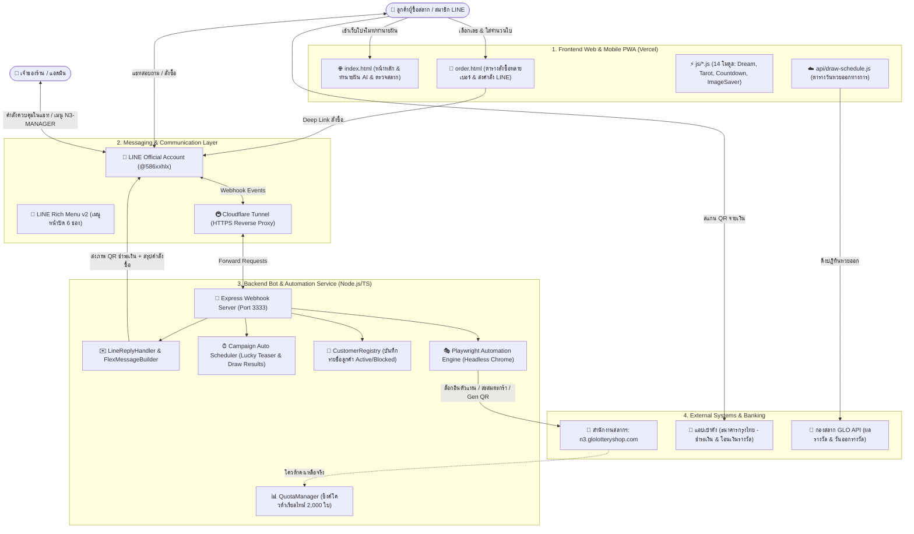

# 🏛️ สถาปัตยกรรมระบบร้านสลาก N3 ธนกิจนำโชค (System Architecture)

เอกสารนี้อธิบายสถาปัตยกรรมเชิงลึกของระบบจำหน่ายและโปรโมทสลากกินแบ่งรัฐบาลตัวเลขสามหลัก (GLO N3) ของร้านสลาก N3 ธนกิจนำโชค (`@586xxhlx`)

---

## 1. ภาพรวมสถาปัตยกรรม (High-Level Architecture)

ระบบประกอบด้วย 4 เลเยอร์หลักที่ทำงานสอดประสานกันแบบเรียลไทม์:

---

## 2. รายละเอียดแต่ละคอมโพเนนต์ (Component Breakdown)

### 2.1 Frontend Web Application (`/`)
* **เทคโนโลยี**: HTML5, Vanilla JavaScript (ES6+), Modern Vanilla CSS, Web Audio API, Web Speech API, Service Worker (PWA)
* **โฮสติ้ง**: Vercel (`https://promote-glon-3.vercel.app`)
* **จุดเด่น**:
  * **Interactive Order Table (`order.html`)**: ตารางกรอกหมายเลขและจำนวนใบ รองรับการสั่งซื้อทีละหลายเบอร์ในบิลเดียว คำนวณยอดเงินรวมอัตโนมัติ พร้อมส่งข้อความเข้าห้องแชท LINE ผ่าน URI Schema `line://oaMessage/{botId}`
  * **AI Dream Predictor (`ai-dream-engine.js`)**: วิเคราะห์ความฝัน ตีเป็นตัวเลข 3 ตัวตรง โต๊ด และ 2 ตัวท้าย ด้วยโมเดลวิเคราะห์คำศัพท์มงคลและสถิติย้อนหลัง
  * **3-Tier Mobile Image Saver (`image-saver.js`)**: ระบบแก้ปัญหาเบราว์เซอร์มือถือ (โดยเฉพาะ LINE Webview และ Samsung Internet) บล็อกแท็ก `<a download>` ด้วยระบบ Long-press Preview Modal, Web Share API Level 2, และ Deep Link `?openExternalBrowser=1`
  * **Official Draw Countdown (`n3-countdown.js`)**: นับเวลาถอยหลังสู่งวดถัดไปโดยเชื่อมโยงกับปฏิทินวันออกรางวัลทางการจากกองสลาก (`official-draw-schedule.json`)

### 2.2 Bot & Automation Backend Service (`bot-service/`)
* **เทคโนโลยี**: Node.js, TypeScript, Express.js, `@line/bot-sdk`, Playwright
* **พอร์ตการทำงาน**: `localhost:3333` เชื่อมต่ออินเทอร์เน็ตผ่าน Cloudflare Tunnel
* **โมดูลภายใน (`bot-service/src/`)**:
  * `automation/`: ควบคุม Google Chrome ผ่าน Playwright อัตโนมัติ (Single-Navigation Cart Accumulation, Direct Canvas Screenshot สำหรับ QR Code 1:1, Headless Session Persistence)
  * `line/`: ประมวลผลข้อความ LINE ตอบกลับด้วย Flex Message ระดับ Retina และส่งภาพ QR เป็น Native Image Message สำหรับปุ่มดาวน์โหลด 1-Tap ในแชท
  * `quota/`: ตรวจสอบและซิงค์โควต้าการจำหน่ายสลาก (2,000 ใบ) จากหน้า Portal จริงของกองสลาก (`QuotaManager` Singleton)
  * `storage/`: จัดการฐานข้อมูลลูกค้าในเครื่อง (`CustomerRegistry` -> `customers.json`)
  * `dream/`: กระจายเลขมงคลแบบไม่ชนกัน (Zero-Collision Shuffled Pool) ให้ลูกค้าแต่ละคนได้รับเลขเฉพาะตัว
  * `guard/`: ตรวจสอบเวลาเปิด-ปิดรับแทงสลากตามเกณฑ์กองสลาก (06:00 - 23:00 น.)

---

## 3. โฟลว์การทำงานหลัก (Key Process Flows)

### 3.1 โฟลว์การสั่งซื้อสลาก (Order Flow)
1. ลูกค้าเข้าเว็บ `order.html` กรอกเลขและจำนวนใบ เช่น `334=5, 447=6`
2. ระบบสร้างข้อความคำสั่งซื้อและเปิดแอป LINE ไปที่ห้องแชทของร้าน
3. ลูกค้ากดส่งข้อความ บอทตรวจจับคำสั่งซื้อและเริ่มงาน Playwright
4. Playwright เปิดหน้าจำหน่ายสลาก สะสมเลขลงตะกร้าในรอบเดียว (Single Navigation)
5. กดยืนยันสร้าง QR ชำระเงิน และจับภาพหน้าจอ Canvas QR Code แบบคมชัด 1:1
6. บอทส่งภาพ QR คู่กับการ์ด Flex Message แจ้งรายละเอียดคำสั่งซื้อ
7. ลูกค้าบันทึกภาพ QR หรือเปิดแอป **"เป๋าตัง"** เพื่อสแกนจ่ายเงิน

### 3.2 โฟลว์การแจ้งผลรางวัลและการตลาดเชิงรุก (Campaign Flow)
1. **ช่วงเช้าวันออกรางวัล (09:30 น.)**: บอทสุ่มเลขมงคลกระจายไม่ซ้ำกัน ส่งเป็นการ์ด "เลขมงคลเปิดดวงเฉพาะคุณ" ให้ลูกค้าทุกคน
2. **ช่วงบ่ายหลังออกรางวัล (15:45 น.)**: บอทดึงข้อมูลผลรางวัลทางการจาก `latest-lottery.json` และส่งการ์ดสรุปผลรางวัล 3 ตัวตรง, 3 ตัวโต๊ด, 2 ตัวตรง, แจ็กพอต และสลาก L6 ให้ลูกค้าทุกคนอัตโนมัติ
3. **การเข้าถึงผ่าน LINE Rich Menu**: ลูกค้าแตะปุ่ม "ผลการออกรางวัล" บน Rich Menu ได้ตลอดเวลา เพื่อเรียกดูผลสลากล่าสุดแบบทันที
